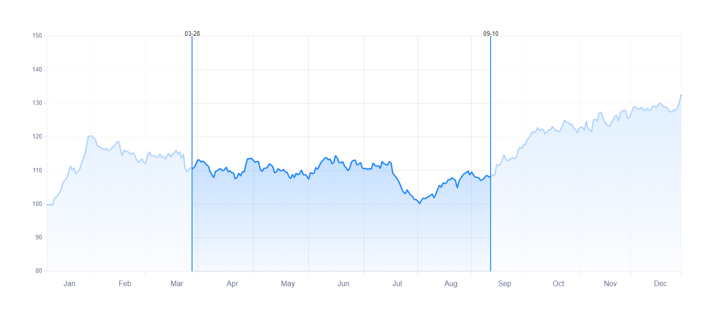

<h1 align="center">Draggable Select Range Plugin | Chart.js</h1>

A ChartJS select range plugin for Line charts. It select a range of chart from X axis

# Introduction
This is a ChartJS selection range plugin for line charts. Selects a range of the chart from the X-axis. You can visually select the desired range on the chart using the mouse and the draggable feature.

It is also possible to display it on the chart by selecting the desired interval with numerical data and using the method available in the plugin. This is a ChartJS selection range plugin for line charts. Selects a range of the chart from the X-axis. You can visually select the desired range on the chart using the mouse and the draggable feature.

# Demo

In the example folder, there is a example to explain the plugin. The demo version is also available online in the link below.

Show online demo: [Online Demo](https://github.com/mohamadhpp)

# Documentation

Plugin documents can be accessed both inside the docs folder and online from the link below.

<a href="https://github.com/mohamadhpp" target="_blank">
    Plugin Online Documentation
</a>